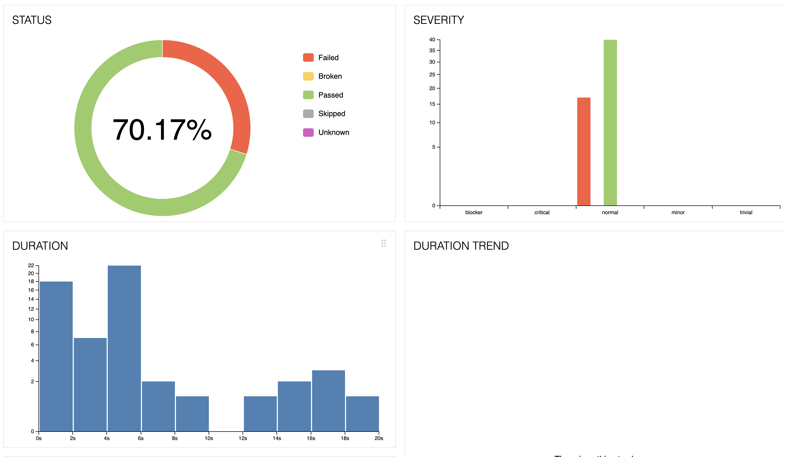

# BugAndAutomationChallenge

This project uses [Playwright](https://playwright.dev/) for automated testing of both UI and API functionalities. The tests are written in JavaScript and leverage the [Faker](https://www.npmjs.com/package/faker) library to generate test data, including negative test data stored in the `utils/data.json` file.

## Project Structure

The tests are organized into two main categories:

- **UI Tests:** Located in `tests/uiTests`
- **API Tests:** Located in `tests/apiTests`

### UI Tests

The UI tests cover various user interface scenarios such as form submissions, navigation, and UI element validations. Playwright’s Page Object Model (POM) is used to encapsulate page interactions, making the tests more maintainable.

### API Tests

API tests focus on validating the behavior of the application’s endpoints. Common scenarios include verifying status codes, response payloads, and ensuring correct error handling.

## Prerequisites

- Node.js (v14 or above)
- Playwright (`@playwright/test`)
- Faker (`faker`)

## Installation

1. Clone the repository:
   ```bash
   git clone https://github.com/your-repo-name.git
   cd your-repo-name
   ```

2. Install dependencies:
   ```bash
   npm install
   ```

3. Install Playwright browsers:
   ```bash
   npx playwright install
   ```

## Running Tests

1. Run all tests:
   ```bash
   npx playwright test
   ```

2. Run UI tests:
   ```bash
   npx playwright test tests/uiTests
   ```

3. Run API tests:
   ```bash
   npx playwright test tests/apiTests
   ```

## Reporting

Playwright provides built-in HTML reports. After running tests, you can view the report by opening the generated `playwright-report/index.html` file.

### Generate and view the Playwright report:
   ```bash
   npx playwright show-report
   ```

## Allure Reporting

This project also supports [Allure](https://docs.qameta.io/allure/) for more detailed test reporting.

### Install the required dependencies:
   ```bash
   npm install --save-dev @playwright/test allure-playwright
   ```

### Set up Allure with Playwright by adding the following to your `playwright.config.js`:
   ```javascript
   const { defineConfig } = require('@playwright/test');

   module.exports = defineConfig({
     reporter: [
       ['html'],
       ['allure-playwright', { outputFolder: 'allure-results' }]
     ],
   });
   ```

### Run your tests:
   ```bash
   npx playwright test
   ```

### Generate the Allure report:
   ```bash
   npx allure generate ./allure-results --clean
   ```

### Open the Allure report:
   ```bash
   npx allure open
   ```

## Bugs Report

- [UI Bugs](bug_report/bugsFound.md)
- [API Bugs](bug_report/apiBugs.md)

## Sample Test Results

All the failed tests are the bugs added in bug report.

