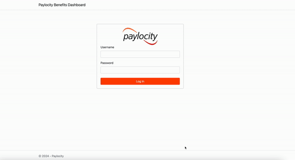
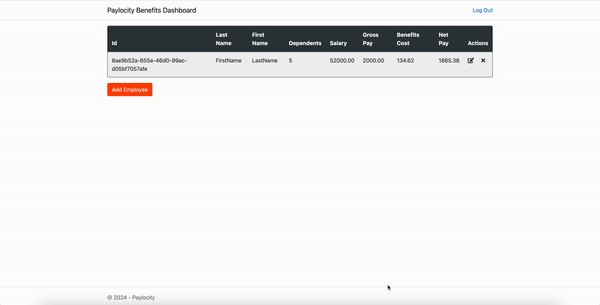
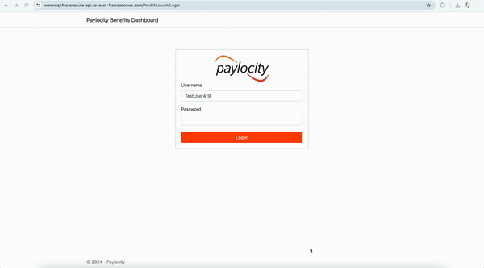
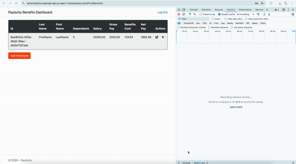
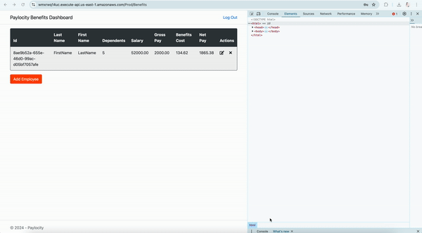
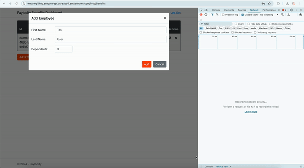
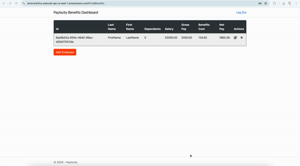

# Benefits Dashboard UI Bugs Report

## Table of Contents
1. [First Name and Last Name are incorrectly displayed](#bug-1-first-name-and-last-name-are-incorrectly-displayed)
2. [Employees table displays empty when developer tools are open and page is refreshed (Logout button disappears on second refresh)](#bug-2-employees-table-displays-empty-when-developer-tools-are-open-and-page-is-refreshed-logout-button-disappears-on-second-refresh)
3. [No error displayed when adding more than 32 or less than 0 dependents (Form fails silently)](#bug-3-no-error-displayed-when-adding-more-than-32-or-less-than-0-dependents-form-fails-silently)
4. [Benefits page accessible without authentication if URL is known](#bug-benefits-page-accessible-without-authentication-if-url-is-known)
5. [No user feedback when First Name, Last Name, and Dependents are left blank](#bug-no-user-feedback-when-first-name-last-name-and-dependents-are-left-blank)
6. [Special characters are allowed in the first and last name](#all-special-characters-are-allowed-in-the-first-and-last-name)
7. [When user is logged out due to inactivity it does not show any error until looked at the api call](#if-tried-to-add-first-and-last-name-with-it-shows-empty-first-and-last-name-after-saving)
8. [First name and last name wrapped in < and > display as blank in Employees Table](#if-tried-to-add-first-and-last-name-with-it-shows-empty-first-and-last-name-after-saving)
9. [No error message for decimals and non-numeric characters in dependents field](#no-error-message-for-decimals-other-characters-in-dependents-field)
9. [Clicking Enter or Return on mac should click the add button](#clicking-enter-or-return-on-mac-should-click-the-add-button)
10. [Clicking add button quickly multiple times adds the employees multiple times](#clicking-add-button-quickly-multiple-times-adds-the-employees-multiple-times)
11. [Edit Employee window says Add Employee](#edit-employee-window-says-add-employee)
12. [Resizing the window does not resize the table border](#resizing-the-window-does-not-resize-the-table-border)
13. [If the application is open in two browser, if you update the name in one browser and dependents in other, the update is not displayed correctly on firefox even after it is refreshed](#if-the-application-is-open-in-two-browser-if-you-update-the-name-in-one-browser-and-dependents-in-other-the-update-is-not-displayed-correctly-on-firefox-even-after-it-is-refreshed)
14. [Cancel button color does not change when hovered over](#cancel-button-color-does-not-change-when-hovered-over)
15. [Putting incorrect username and password gives different page instead of showing errors](#putting-incorrect-username-and-password-gives-different-page-instead-of-showing-errors)
16. [No option to sort the users](#no-option-to-sort-the-users)
17. [There is no limit to logging attempts](#there-is-no-limit-to-logging-attempts)

---

## Bug 1: First Name and Last Name are incorrectly displayed

**Priority:** High

**Description:**

The first name and last name are reversed in the employee table. The first name shows under last name column and last name shows under first name.

**Steps to reproduce:**

1. Navigate to <https://wmxrwq14uc.execute-api.us-east-1.amazonaws.com/Prod/Account/Login>
2. Log in with valid credentials.
3. Click on "Add Employee" button.
4. Fill in First Name, Last Name, and Dependants.
5. Click "Add" button.

**Expected result:** The Employee table should display data accurately, with each column's content matching its respective header.

**Actual result:** The First Name and Last Name columns are swapped. The "First Name" column contains the Last Name, and the "Last Name" column contains the First Name.

**Attachments:**

---

## Bug 2: Employees table displays empty when developer tools are open and page is refreshed (Logout button disappears on second refresh)

**Priority:** High

**Description:**

When the browser's developer tools are open and the dashboard page is refreshed, the Employees table appears empty even if there are employees added. Additionally, refreshing the page a second time causes the logout button to disappear.

**Steps to Reproduce:**

1. Navigate to <https://wmxrwq14uc.execute-api.us-east-1.amazonaws.com/Prod/Account/Login>
2. Log in with valid credentials.
3. Open the browser's developer tools by right-clicking and clicking Inspect.
4. Refresh the dashboard page.
5. Observe the Employees table.
6. Refresh the page again.
7. Observe the disappearance of the logout button.

**Expected Result:**

- The Employees table should display all employee records as expected, regardless of whether the developer tools are open, or the page is refreshed.
- The logout button should remain visible after refreshing the page.

**Actual Result:**

- The Employees table is empty when the page is refreshed with the developer tools open, even though employees have been added.
- Refreshing the page a second time causes the logout button to disappear.

**Attachments:**

---

## Bug 3: No Error Displayed When Adding More Than 32 or Less Than 0 Dependents (Form Fails Silently)

**Priority:** High

**Description:**

The UI does not show any error or validation message when attempting to add more than 32 or less than 0 dependents while adding a new employee. The form fails silently after clicking the "Add" button, leaving the user confused as no feedback is provided. The issue is only noticeable when checking the API call.

**Steps to Reproduce:**

1. Navigate to <https://wmxrwq14uc.execute-api.us-east-1.amazonaws.com/Prod/Account/Login>
2. Log in with valid credentials.
3. Click on the "Add Employee" button.
4. Fill in the First Name and Last Name fields.
5. Enter a number greater than 32 or less than 0 in the Dependents field.
6. Click the "Add" button.

**Expected Result:**

The system should display an error message indicating that the number of dependents must be between 0 and 32. The user should receive clear feedback when the input is invalid.

**Actual Result:**

The "Add" button does not trigger any action. The form remains unchanged, and no error or validation message is shown. The user is left unsure of what went wrong until inspecting the API call.

**Attachments:**

---

## Bug 4: Benefits page accessible without authentication if URL is known

**Priority:** High

**Description:**

The benefits page can be accessed directly if the URL is known, bypassing the authentication process. This issue allows unauthorized users to access benefits page without logging in.

**Steps to Reproduce:**

1. Navigate to <https://wmxrwq14uc.execute-api.us-east-1.amazonaws.com/Prod/Account/Login>
2. Log in with valid credentials.
3. Copy the benefits page link (<https://wmxrwq14uc.execute-api.us-east-1.amazonaws.com/Prod/Benefits>)
4. Click Log out.
5. Paste the benefits page link in another tab.
6. It does not ask for authentication and shows empty benefits table.

**Expected Result:**

The benefits page should require authentication (username and password) before granting access.
Unauthorized users should not be able to access the benefits page even if they know the URL.

**Actual Result:**

The benefits page is accessible without authentication if the URL is known.

**Attachments:**

---

## Bug 5: No user feedback when First Name, Last Name, and Dependents are left blank

**Priority:** High

**Description:**

When the First Name, Last Name, and Dependents fields are left blank and the user clicks the "Add" button, the form does not proceed, and no user feedback is provided. The error is only visible upon inspecting the API call.

**Steps to Reproduce:**

1. Navigate to <https://wmxrwq14uc.execute-api.us-east-1.amazonaws.com/Prod/Account/Login>
2. Log in with valid credentials.
3. Click on the "Add Employee" button.
4. Keep the First Name and Last Name and Dependants fields blank.
6. Click the "Add" button.

**Expected Result:**

An error message should be displayed to the user indicating that the First Name, Last Name, and Dependents fields are required.
The form should not be submitted and should provide immediate feedback when these fields are left blank.

**Actual Result:**

The form does not proceed and no error message is displayed to the user.
The error is only visible in the API call response, which does not inform the user directly.

**Attachments:**

---
## Bug 6: Special characters are allowed in the first and last name fields.

**Priority:** High

**Description:**

When special charactersare allowed in the First Name and Last Name fields.

**Steps to Reproduce:**

1. Navigate to https://your-app-url.com/form-submission
2. Log in with valid credentials (if required).
3. Click on the "Add Employee" button (or equivalent).
4. Enter special characters (e.g., @, #, $, %, ^, &, *, !) and numbers (e.g., 123) in the First Name field.
5. Enter special characters and numbers in the Last Name field.
6. Click the "Add" button to submit the form.

**Expected Result:**

The First Name and Last Name fields should only accept alphanumeric characters.
An error message should be displayed to the user if special characters are entered.
The form should not be submitted until valid data is provided.

**Actual Result:**

The form accepts special characters in the First Name and Last Name fields.

**Attachments:**

---
## Bug 7: No error or notification displayed when user is logged out due to inactivity.

**Priority:** High

**Description:**

When a user is logged out due to inactivity, no error message or notification is displayed to inform the user of their logged-out status. The issue is only evident by inspecting the API call, which returns an "unauthorized" error indicating that the session has expired.

**Steps to Reproduce:**

1. Navigate to https://your-app-url.com/form-submission
2. Log in with valid credentials (if required).
3. Leave the application inactive for a period longer than the session timeout duration.
4. Attempt to perform any action that requires authentication.
5. Observe that no error message or notification is displayed to indicate that the user session has expired.
6. Inspect the API call to see the "unauthorized" error response indicating that the session has expired or the user is no longer authenticated.

**Expected Result:**

The user should receive an error message or notification indicating that they have been logged out due to inactivity.
The application should prompt the user to log in again

**Actual Result:**

No error message or notification is displayed to the user when they are logged out due to inactivity.
The "unauthorized" error is only visible through the API call, indicating that the session has expired or the user is no longer authenticated.

**Attachments:**

---
## Bug 8: First name and last name wrapped in < and > display as blank in Employees Table.

**Priority:** High

**Description:**

When attempting to add First Name and Last Name fields wrapped in < and > , these fields appear empty in the Employees table after saving. 

**Steps to Reproduce:**

1. Navigate to https://your-app-url.com/form-submission
2. Log in with valid credentials (if required).
3. Click on the "Add Employee" button (or equivalent).
4. Enter any text wrapped in <> (ex. <Test>) in the First Name field.
5. Enter any text wrapped in <> (ex. <User>) in the Last Name field.
6. Click the "Add" button to submit the form.

**Expected Result:**

The Employees table should display the First Name and Last Name correctly, including characters like < and >.

**Actual Result:**

The Employees table displays the First Name and Last Name fields as empty when names are entered with < and >.

**Attachments:**

---
## Bug 9: No error message for decimals and non-numeric characters in dependents field.

**Priority:** High

**Description:**

When attempting to add First Name and Last Name fields wrapped in < and > , these fields appear empty in the Employees table after saving. 

**Steps to Reproduce:**

1. Navigate to https://your-app-url.com/form-submission
2. Log in with valid credentials (if required).
3. Click on the "Add Employee" button (or equivalent).
4. Enter any text wrapped in <> (ex. <Test>) in the First Name field.
5. Enter any text wrapped in <> (ex. <User>) in the Last Name field.
6. Click the "Add" button to submit the form.

**Expected Result:**

The Employees table should display the First Name and Last Name correctly, including characters like < and >.

**Actual Result:**

The Employees table displays the First Name and Last Name fields as empty when names are entered with < and >.

**Attachments:**

