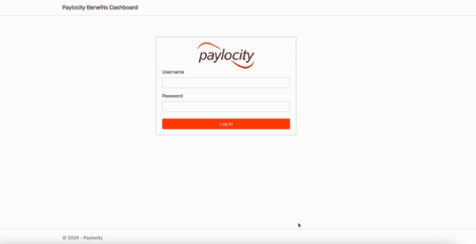
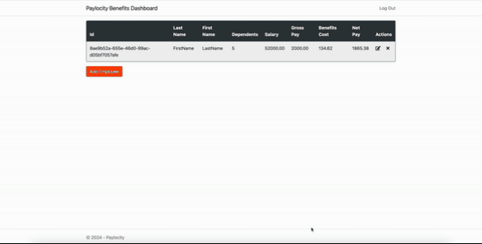
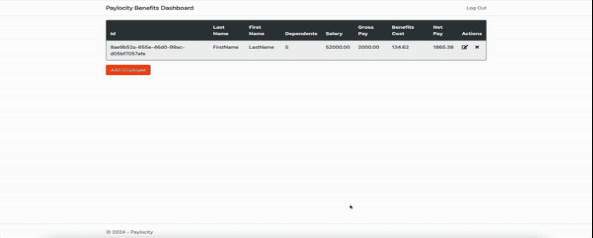

Below is the report for the UI bugs found during testing of Benefits Dashboard.

\1) First Name and Last Name are incorrectly displayed\.

\2) The benefits page can be accessed without username and passwordif the url is known\.

\3) If developer tool is open, the dashboard page shows empty employees table\.

4)UI does not show any error when trying to add dependents more than 32 or less than 0

\8) All special characters are allowed in the first and last name\.

5)There is no error message when first name last name and dependents are kept blank.

\7) If tried to add first and last name with <> it shows empty first and last name after saving\.

\9) No error message for decimals, other characters in dependents field\.

\10) Clicking Enter or Return on mac should click the add button\.

\11) Clicking add button quickly multiple times adds the employees multiple times\.

\12) Edit Employee window says Add Employee\.

\13) Resizing the window does not resize the table border\.

\16) If the application is open in two browser, if you update the name in one browser and dependents in other, the update is not displayed correctly on firefox even after it is refreshed\.

\17) Cancel button color does not changes when hovered over\.

18)pUTTING iNCORRECT USERNAME AND PASSWORD GIVES different page instead of showing errors.

\19) No option to sort the users\.

\20) There is no limit logging attempts\.

**Bug 1. First Name and Last Name are incorrectly displayed.**

**Priority:** High

**Description:**

The first name and last name are reversed in the employee table. The first name shows under last name column and last name shows under first name.

**Steps to reproduce:**

1. Navigate to <https://wmxrwq14uc.execute-api.us-east-1.amazonaws.com/Prod/Account/Login>  
1. Log in with valid credentials.
1. Click on "Add Employee" button.
1. Fill in First Name, Last Name and Dependants.
1. Click "Add" button;

**Expected result:** The Employee table should display data accurately, with each column's content matching its respective header. 

**Actual result:** The First Name and Last Name columns are swapped. The "First Name" column contains the Last Name, and the "Last Name" column contains the First Name.

**Attachments:**

**Bug 2: Employees Table Displays Empty When Developer Tools Are Open and Page is Refreshed (Logout Button Disappears on Second Refresh)**

**Priority:** High

**Description:**
When the browser's developer tools are open and the dashboard page is refreshed, the Employees table appears empty even if there are employees added. Additionally, refreshing the page a second time causes the logout button to disappear.

**Steps to Reproduce:**

1. Navigate to <https://wmxrwq14uc.execute-api.us-east-1.amazonaws.com/Prod/Account/Login>.
1. Log in with valid credentials.
1. Open the browser's developer tools by right clicking and click Inspect.
1. Refresh the dashboard page.
1. Observe the Employees table.
1. Refresh the page again.
1. Observe the disappearance of the logout button.

**Expected Result:**

- The Employees table should display all employee records as expected, regardless of whether the developer tools are open, or the page is refreshed.
- The logout button should remain visible after refreshing the page.

**Actual Result:**

- The Employees table is empty when the page is refreshed with the developer tools open, even though employees have been added.
- Refreshing the page a second time causes the logout button to disappear.

**Attachments:**

**Bug 3: No Error Displayed When Adding More Than 32 or Less Than 0 Dependents (Form Fails Silently)**

**Priority:** High

**Description:**
The UI does not show any error or validation message when attempting to add more than 32 or less than 0 dependents while adding a new employee. The form fails silently after clicking the "Add" button, leaving the user confused as no feedback is provided. The issue is only noticeable when checking the API call.

**Steps to Reproduce:**

1. Navigate to <https://wmxrwq14uc.execute-api.us-east-1.amazonaws.com/Prod/Account/Login>.
1. Log in with valid credentials.
1. Click on the "Add Employee" button.
1. Fill in the First Name and Last Name fields.
1. Enter a number greater than 32 or less than 0 in the Dependents field.
1. Click the "Add" button.

**Expected Result:**
The system should display an error message indicating that the number of dependents must be between 0 and 32. The user should receive clear feedback when the input is invalid.

**Actual Result:**
The "Add" button does not trigger any action. The form remains unchanged, and no error or validation message is shown. The user is left unsure of what went wrong until inspecting the API call.

**Attachments:**

