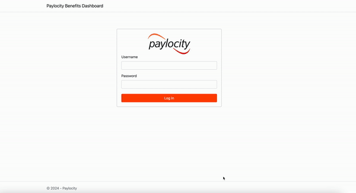
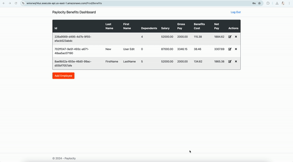

# Benefits Dashboard Bugs Report

Below are the bugs found during testing:
1. [First Name and Last Name are incorrectly displayed](#bug-1-first-name-and-last-name-are-incorrectly-displayed)
2. [Employees table displays empty when developer tools are open and page is refreshed (Logout button disappears on second refresh)](#bug-2-employees-table-displays-empty-when-developer-tools-are-open-and-page-is-refreshed-logout-button-disappears-on-second-refresh)
3. [No error displayed when adding more than 32 or less than 0 dependents (Form fails silently)](#bug-3-no-error-displayed-when-adding-more-than-32-or-less-than-0-dependents-form-fails-silently)
4. [Benefits page accessible without authentication if URL is known](#bug-4-benefits-page-accessible-without-authentication-if-url-is-known)
5. [No user feedback when First Name, Last Name, and Dependents are left blank](#bug-5-no-user-feedback-when-first-name-last-name-and-dependents-are-left-blank)
6. [Special characters are allowed in the first and last name](#bug-6-special-characters-are-allowed-in-the-first-and-last-name-fields)
7. [No error or notification displayed when user is logged out due to inactivity](#bug-7-no-error-or-notification-displayed-when-user-is-logged-out-due-to-inactivity)
8. [First name and last name wrapped in \< and \> display as blank in Employees Table](#bug-8-first-name-and-last-name-wrapped-in--and--display-as-blank-in-employees-table)
9. [No error message for decimals and non-numeric characters in dependents field](#bug-9-no-error-message-for-decimals-and-non-numeric-characters-in-dependents-field)
10. [Pressing the Enter key on the keyboard does not trigger the Add button](#bug-10-pressing-the-enter-key-on-the-keyboard-does-not-trigger-the-add-button)
11. [Clicking add button quickly multiple times adds duplicate employees](#bug-11-clicking-add-button-quickly-multiple-times-adds-duplicate-employees)
12. [Update Employee window displays "Add Employee"](#bug-12-update-employee-window-displays-add-employee)
13. [Table border misaligns with table content after window resizing](#bug-13-table-border-misaligns-with-table-content-after-window-resizing)
14. [Updating deleted record is possible and saves incorrect data (0 Salary and Gross Pay) when update and delete are performed in different tabs/browsers](#bug-14-updating-deleted-record-is-possible-and-saves-incorrect-data-0-salary-and-gross-pay-when-update-and-delete-are-performed-in-different-tabsbrowsers)
15. [Cancel button color does not change when hovered over](#bug-15-cancel-button-color-does-not-change-when-hovered-over)
16. [Putting incorrect username and password gives different page instead of showing errors](#bug-16-putting-incorrect-username-and-password-gives-different-page-instead-of-showing-errors)
17. [No option to sort the users](#bug-17-no-option-to-sort-the-users)
18. [There is no limit to logging attempts](#bug-18-there-is-no-limit-to-logging-attempts)
19. [Cross site scripting is allowed in first and last name field](#bug-19-cross-site-scripting-is-allowed-in-first-and-last-name-field)
20. [CSV injection is allowed in first and last name field](#bug-20-csv-injection-is-allowed-in-first-and-last-name-field)
21. [No error displayed when adding more than 50 characters in first and last name field](#bug-21-no-error-displayed-when-adding-more-than-50-characters-in-first-and-last-name-field)
22. [No option to delete multiple records](#bug-22-no-option-to-delete-multiple-records)
23. [No login button present, user has to use link to login](#bug-23-no-login-button-present-user-has-to-use-link-to-login)

---
## Bug 1: First Name and Last Name are incorrectly displayed

**Priority:** High

**Description:**

The first name and last name are reversed in the employee table. The first name shows under last name column and last name shows under first name.

**Steps to reproduce:**

1. Navigate to <https://wmxrwq14uc.execute-api.us-east-1.amazonaws.com/Prod/Account/Login>
2. Log in with valid credentials.
3. Click on "Add Employee" button.
4. Fill in First Name, Last Name, and Dependents.
5. Click "Add" button.

**Expected result:** The Employee table should display data accurately, with each column's content matching its respective header.

**Actual result:** The First Name and Last Name columns are swapped. The "First Name" column contains the Last Name, and the "Last Name" column contains the First Name.

**Attachments:**

---
## Bug 2: Employees table displays empty when developer tools are open and page is refreshed (Logout button disappears on second refresh)

**Priority:** High

**Description:**

When the browser's developer tools are open and the dashboard page is refreshed, the Employees table appears empty even if there are employees added. Additionally, refreshing the page a second time causes the logout button to disappear.

**Steps to Reproduce:**

1. Navigate to <https://wmxrwq14uc.execute-api.us-east-1.amazonaws.com/Prod/Account/Login>
2. Log in with valid credentials.
3. Open the browser's developer tools by right-clicking and clicking Inspect.
4. Refresh the dashboard page.
5. Observe the Employees table.
6. Refresh the page again.
7. Observe the disappearance of the logout button.

**Expected Result:**

- The Employees table should display all employee records as expected, regardless of whether the developer tools are open, or the page is refreshed.
- The logout button should remain visible after refreshing the page.

**Actual Result:**

- The Employees table is empty when the page is refreshed with the developer tools open, even though employees have been added.
- Refreshing the page a second time causes the logout button to disappear.

**Attachments:**

---
## Bug 3: No Error Displayed When Adding More Than 32 or Less Than 0 Dependents (Form Fails Silently)

**Priority:** High

**Description:**

The UI does not show any error or validation message when attempting to add more than 32 or less than 0 dependents while adding a new employee. The form fails silently after clicking the "Add" button, leaving the user confused as no feedback is provided. The issue is only noticeable when checking the API call.

**Steps to Reproduce:**

1. Navigate to <https://wmxrwq14uc.execute-api.us-east-1.amazonaws.com/Prod/Account/Login>
2. Log in with valid credentials.
3. Click on the "Add Employee" button.
4. Fill in the First Name and Last Name fields.
5. Enter a number greater than 32 or less than 0 in the Dependents field.
6. Click the "Add" button.

**Expected Result:**

The system should display an error message indicating that the number of dependents must be between 0 and 32. The user should receive clear feedback when the input is invalid.

**Actual Result:**

The "Add" button does not trigger any action. The form remains unchanged, and no error or validation message is shown. The user is left unsure of what went wrong until inspecting the API call.

**Attachments:**

---
## Bug 4: Benefits page accessible without authentication if URL is known

**Priority:** High

**Description:**

The benefits page can be accessed directly if the URL is known, bypassing the authentication process. This issue allows unauthorized users to access benefits page without logging in.

**Steps to Reproduce:**

1. Navigate to <https://wmxrwq14uc.execute-api.us-east-1.amazonaws.com/Prod/Account/Login>
2. Log in with valid credentials.
3. Copy the benefits page link (<https://wmxrwq14uc.execute-api.us-east-1.amazonaws.com/Prod/Benefits>)
4. Click Log out.
5. Paste the benefits page link in another tab.
6. It does not ask for authentication and shows empty benefits table.

**Expected Result:**

The benefits page should require authentication (username and password) before granting access.
Unauthorized users should not be able to access the benefits page even if they know the URL.

**Actual Result:**

The benefits page is accessible without authentication if the URL is known.

**Attachments:**

---
## Bug 5: No user feedback when First Name, Last Name, and Dependents are left blank

**Priority:** High

**Description:**

When the First Name, Last Name, and Dependents fields are left blank and the user clicks the "Add" button, the form does not proceed, and no user feedback is provided. The error is only visible upon inspecting the API call.

**Steps to Reproduce:**

1. Navigate to <https://wmxrwq14uc.execute-api.us-east-1.amazonaws.com/Prod/Account/Login>
2. Log in with valid credentials.
3. Click on the "Add Employee" button.
4. Keep the First Name and Last Name and Dependents fields blank.
6. Click the "Add" button.

**Expected Result:**

An error message should be displayed to the user indicating that the First Name, Last Name, and Dependents fields are required.
The form should not be submitted and should provide immediate feedback when these fields are left blank.

**Actual Result:**

The form does not proceed and no error message is displayed to the user.
The error is only visible in the API call response, which does not inform the user directly.

**Attachments:**

---
## Bug 6: Special characters are allowed in the first and last name fields.

**Priority:** High

**Description:**

When special charactersare allowed in the First Name and Last Name fields.

**Steps to Reproduce:**

1. Navigate to <https://wmxrwq14uc.execute-api.us-east-1.amazonaws.com/Prod/Account/Login>
2. Log in with valid credentials.
3. Click on the "Add Employee" button.
4. Enter special characters (e.g., @, #, $, %, ^, &, *, !) and numbers (e.g., 123) in the First Name field.
5. Enter special characters and numbers in the Last Name field.
6. Click the "Add" button to submit the form.

**Expected Result:**

The First Name and Last Name fields should only accept alphanumeric characters.
An error message should be displayed to the user if special characters are entered.
The form should not be submitted until valid data is provided.

**Actual Result:**

The form accepts special characters in the First Name and Last Name fields.

**Attachments:**

---
## Bug 7: No error or notification displayed when user is logged out due to inactivity.

**Priority:** High

**Description:**

When a user is logged out due to inactivity, no error message or notification is displayed to inform the user of their logged-out status. The issue is only evident by inspecting the API call, which returns an "unauthorized" error indicating that the session has expired.

**Steps to Reproduce:**

1. Navigate to <https://wmxrwq14uc.execute-api.us-east-1.amazonaws.com/Prod/Account/Login>
2. Log in with valid credentials.
3. Leave the application inactive for a period longer than the session timeout duration.
4. Attempt to perform any action that requires authentication.
5. Observe that no error message or notification is displayed to indicate that the user session has expired.
6. Inspect the API call to see the "unauthorized" error response indicating that the session has expired or the user is no longer authenticated.

**Expected Result:**

The user should receive an error message or notification indicating that they have been logged out due to inactivity.
The application should prompt the user to log in again

**Actual Result:**

No error message or notification is displayed to the user when they are logged out due to inactivity.
The "unauthorized" error is only visible through the API call, indicating that the session has expired or the user is no longer authenticated.

**Attachments:**

---
## Bug 8: First name and last name wrapped in < and > display as blank in Employees Table.

**Priority:** High

**Description:**

When attempting to add First Name and Last Name fields wrapped in < and > , these fields appear empty in the Employees table after saving. 

**Steps to Reproduce:**

1. Navigate to <https://wmxrwq14uc.execute-api.us-east-1.amazonaws.com/Prod/Account/Login>
2. Log in with valid credentials.
3. Click on the "Add Employee" button (or equivalent).
4. Enter any text wrapped in <> (ex. <Test>) in the First Name field.
5. Enter any text wrapped in <> (ex. <User>) in the Last Name field.
6. Click the "Add" button to submit the form.

**Expected Result:**

The Employees table should display the First Name and Last Name correctly, including characters like < and >.

**Actual Result:**

The Employees table displays the First Name and Last Name fields as empty when names are entered with < and >.

**Attachments:**

---
## Bug 9: No error message for decimals and non-numeric characters in dependents field.

**Priority:** High

**Description:**

The Dependents field accepts decimals and non-numeric characters without displaying any validation error messages. The API call returns a "405 Method Not Allowed" error when submitting the form with invalid input, but no information or feedback is provided to the user, and the record is not added.

**Steps to Reproduce:**

1. Navigate to <https://wmxrwq14uc.execute-api.us-east-1.amazonaws.com/Prod/Account/Login>
2. Log in with valid credentials.
3. Click on the "Add Employee" button (or equivalent).
4. Enter a decimal number (e.g., 2.5) in the Dependents field.
5. Enter non-numeric characters (e.g., abc) in the Dependents field.
6. Click the "Add" button.
7. Observe that no error message is displayed to indicate the invalid input.
8. Inspect the API call to see the "405 Method Not Allowed" error response.

**Expected Result:**

The Dependents field should only accept whole numbers.
An error message should be displayed if decimals or non-numeric characters are entered.
The form should not be submitted, and the user should be informed of the invalid input.

**Actual Result:**

The Dependents field accepts decimals and non-numeric characters without validation.
No error message or feedback is provided to the user when invalid input is entered.
The API call returns a "405 Method Not Allowed" error, and the record is not added.
The user is not informed of the issue, and no record is added.

**Attachments:**

---
## Bug 10: Pressing the Enter key on the keyboard does not trigger the Add button.

**Priority:** Medium

**Description:**

Pressing the Enter key on the keyboard does not work for the "Add" button, preventing the user from adding the record using the keyboard. This issue impacts user experience by not providing a standard way to submit the form via keyboard input.

**Steps to Reproduce:**

1. Navigate to <https://wmxrwq14uc.execute-api.us-east-1.amazonaws.com/Prod/Account/Login>
2. Log in with valid credentials.
3. Click on the "Add Employee" button (or equivalent).
4. Enter First Name, Last Name, and Dependents.
5. Press Enter/Return on keyboard.
6. Observe that the mouse cursor disappears and "Add" button is not triggered, and the record is not added.

**Expected Result:**

The record should be added successfully when the Enter key is pressed.

**Actual Result:**

The record is not added, and the user is required to manually click the "Add" button.

**Attachments:**

---
## Bug 11: Clicking add button quickly multiple times adds duplicate employees.

**Priority:** Medium

**Description:**

Pressing the Enter key on the keyboard does not work for the "Add" button, preventing the user from adding the record using the keyboard. This issue impacts user experience by not providing a standard way to submit the form via keyboard input.

**Steps to Reproduce:**

1. Navigate to <https://wmxrwq14uc.execute-api.us-east-1.amazonaws.com/Prod/Account/Login>
2. Log in with valid credentials.
3. Click on the "Add Employee" button.
4. Enter First Name, Last Name, and Dependents.
5. Press Enter/Return on keyboard.
6. Observe that the mouse cursor disappears and "Add" button is not triggered, and the record is not added.

**Expected Result:**

The record should be added successfully when the Enter key is pressed.

**Actual Result:**

The record is not added, and the user is required to manually click the "Add" button.

**Attachments:**

---
## Bug 12: Update Employee window displays "Add Employee".

**Priority:** Medium

**Description:**

In the "Update Employee" window, the title incorrectly displays "Add Employee" instead of "Update Employee." This mislabeling can lead to confusion about the function of the window, as users may mistakenly think they are adding a new employee rather than updating an existing one.

**Steps to Reproduce:**

1. Navigate to <https://wmxrwq14uc.execute-api.us-east-1.amazonaws.com/Prod/Account/Login>
2. Log in with valid credentials.
3. Click on the "Update Employee" button.
4. Observe the window title.

**Expected Result:**

The "Update Employee" window should display the correct title.

**Actual Result:**

The "Update Employee" window incorrectly displays "Add Employee."

**Attachments:**

---
## Bug 13: Table border misaligns with table content after window resizing.

**Priority:** Medium

**Description:**

When resizing the browser window, the table border and the table content become misaligned. The border does not correctly adjust with the resized window, causing the border to appear incorrectly within the table, rather than aligning with the table edges.

**Steps to Reproduce:**

1. Navigate to <https://wmxrwq14uc.execute-api.us-east-1.amazonaws.com/Prod/Account/Login>
2. Log in with valid credentials.
3. Observe the table displayed on the page.
4. Resize the browser window by dragging its edges or corners to change its dimensions.
5. Notice that the table border adjusts but does not align correctly with the table content.
6. The border appears to overlap or come in between the table content, causing a visual mismatch.

**Expected Result:**

The table border should adjust dynamically and align properly with the table content during window resizing.
The border should correctly frame the table content without appearing misplaced or overlapping.

**Actual Result:**

The table border misaligns with the table content after resizing the window.
The border appears to come in between the table content, causing a visual mismatch and layout issues.

**Attachments:**

---
## Bug 14: Updating deleted record is possible and saves incorrect data (0 Salary and Gross Pay) when update and delete are performed in different tabs/browsers.

**Priority:** High

**Description:**

When the application is open in two separate tabs or browsers, deleting a record in one tab and then attempting to update the same record in the other tab without refreshing the page results in the update being saved with incorrect values. Specifically, the salary and gross pay fields are set to 0 and net pay is displayed negative, despite the record having been deleted.

**Steps to Reproduce:**

1. Open the application in two separate browser tabs.
2. Log in with valid credentials.
3. In the first tab, navigate to the record you want to delete.
4. Delete the record.
5. In the second tab, navigate to the same record that was deleted.
6. Without refreshing the second tab, attempt to update the record (e.g., modify salary or other fields).
7. Save the changes.

**Expected Result:**

The application should reflect the deletion of the record across all tabs or browsers.
Attempting to update a deleted record should result in an appropriate error message or prevent the update from being saved.
The update operation should not save with incorrect values like 0 salary and gross pay.

**Actual Result:**

Updating the deleted record in the second tab results in saving incorrect values (0 salary and gross pay) because the record no longer exists.
No error message is shown, and the application allows the update with these incorrect values.

**Attachments:**

---
## Bug 15: Cancel button color does not change on hover (Unlike Add , Update and Delete buttons)

**Priority:** Low

**Description:**

The "Cancel" button on the "Add Employee," "Update Employee," and "Delete Employee" windows does not change color when hovered over, which is inconsistent with expected UI behavior. Typically, buttons provide visual feedback (such as color changes) when hovered over, signaling to the user that the button is interactive. The lack of this expected response affects the user experience by not clearly indicating the button's interactivity.

**Steps to Reproduce:**

1. Open the application in two separate browser tabs.
2. Log in with valid credentials.
3. Click on the "Add Employee" button.
4. Hover your cursor over the "Cancel" button.
5. Observe that the button’s color remains unchanged, providing no visual feedback.
6. Hover over the "Add" and "Update" buttons and observe that they do change color when hovered over.

**Expected Result:**

The "Cancel" button should change color or provide some visual feedback when hovered over, similar to the "Add" and "Update" buttons.

**Actual Result:**

The "Cancel" button does not change color or provide any visual indication when hovered over, unlike the "Add" and "Update" buttons, which do provide visual feedback.

**Attachments:**

