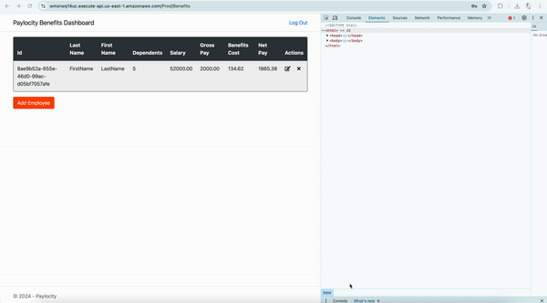

# Benefits Dashboard Bugs Report

Below are the bugs found during testing:
1. [First Name and Last Name are incorrectly displayed](#bug-1-first-name-and-last-name-are-incorrectly-displayed)
2. [Employees table displays empty when developer tools are open and page is refreshed (Logout button disappears on second refresh)](#bug-2-employees-table-displays-empty-when-developer-tools-are-open-and-page-is-refreshed-logout-button-disappears-on-second-refresh)
3. [No error displayed when adding more than 32 or less than 0 dependents (Form fails silently)](#bug-3-no-error-displayed-when-adding-more-than-32-or-less-than-0-dependents-form-fails-silently)
4. [Benefits page accessible without authentication if URL is known](#bug-4-benefits-page-accessible-without-authentication-if-url-is-known)
5. [No user feedback when First Name, Last Name, and Dependents are left blank](#bug-5-no-user-feedback-when-first-name-last-name-and-dependents-are-left-blank)
6. [Special characters are allowed in the first and last name](#bug-6-special-characters-are-allowed-in-the-first-and-last-name-fields)
7. [No error or notification displayed when user is logged out due to inactivity](#bug-7-no-error-or-notification-displayed-when-user-is-logged-out-due-to-inactivity)
8. [First name and last name wrapped in < and > display as blank in Employees Table](#bug-8-first-name-and-last-name-wrapped-in--and--display-as-blank-in-employees-table)
9. [No error message for decimals and non-numeric characters in dependents field](#bug-9-no-error-message-for-decimals-and-non-numeric-characters-in-dependents-field)
10. [Pressing the Enter key on the keyboard does not trigger the Add button](#bug-10-pressing-the-enter-key-on-the-keyboard-does-not-trigger-the-add-button)
11. [Clicking add button quickly multiple times adds duplicate employees](#bug-11-clicking-add-button-quickly-multiple-times-adds-duplicate-employees)
12. [Edit Employee window displays "Add Employee"](#bug-12-edit-employee-window-displays-add-employee)
13. [Table border misaligns with table content after window resizing](#bug-13-table-border-misaligns-with-table-content-after-window-resizing)
14. [Updating deleted record is possible and saves incorrect data (0 Salary and Gross Pay) when update and delete are performed in different tabs/browsers](#bug-14-updating-deleted-record-is-possible-and-saves-incorrect-data-0-salary-and-gross-pay-when-update-and-delete-are-performed-in-different-tabsbrowsers)
15. [Cancel button color does not change on hovered over](#bug-15-cancel-button-color-does-not-change-when-hovered-over)
16. [Incorrect username submission leads to an HTTP ERROR 405 page instead of showing an error message](#bug-16-incorrect-username-submission-leads-to-an-http-error-405-page-instead-of-showing-an-error-message)
17. [Missing option to sort users in employee table on Benefits Dashboard Page](#bug-17-missing-option-to-sort-users-in-employee-table-on-benefits-dashboard-page)
18. [No limit on login attempts](#bug-18-no-limit-on-login-attempts)
19. [Stored Cross-Site Scripting (XSS) allowed in first and last name fields](#bug-19-stored-cross-site-scripting-xss-allowed-in-first-and-last-name-fields)
20. [CSV Injection allowed in First and Last Name fields](#bug-20-csv-injection-allowed-in-first-and-last-name-fields)
21. [No error displayed when adding more than 50 characters in first and last name field](#bug-21-no-error-displayed-when-adding-more-than-50-characters-in-first-and-last-name-field)
22. [No option to delete multiple records](#bug-22-no-option-to-delete-multiple-records)
23. [Edit and Delete button not accessible through keyboard](#bug-23-edit-and-delete-button-not-accessible-through-keyboard)
24. [The token is in Base 64 which can be easily decoded to get username and password](#bug-24-the-token-is-in-base-64-which-can-be-easily-decoded-to-get-username-and-password)
25. [There is no limit or pagination available for the records in employee table.](#bug-25-there-is-no-limit-or-pagination-available-for-the-records-in-employee-table)
26. [HTML Injection Allowed in First Name and Last Name Fields](#bug-26-html-injection-allowed-in-first-name-and-last-name-fields)
27. [Clicking Outside Add, Edit, or Delete Window Disappears the Window](#bug-27-clicking-outside-add-edit-or-delete-window-disappears-the-window)

---
## Bug 1: First Name and Last Name are incorrectly displayed

**Priority:** High

**Description:**

The first name and last name are reversed in the employee table. The first name shows under last name column and last name shows under first name.

**Steps to reproduce:**

1. Navigate to <https://wmxrwq14uc.execute-api.us-east-1.amazonaws.com/Prod/Account/Login>
2. Log in with valid credentials.
3. Click on "Add Employee" button.
4. Fill in First Name, Last Name, and Dependents.
5. Click "Add" button.

**Expected result:** The Employee table should display data accurately, with each column's content matching its respective header.

**Actual result:** The First Name and Last Name columns are swapped. The "First Name" column contains the Last Name, and the "Last Name" column contains the First Name.

**Attachments:**

---
## Bug 2: Employees table displays empty when developer tools are open and page is refreshed (Logout button disappears on second refresh)

**Priority:** High

**Description:**

When the browser's developer tools are open and the dashboard page is refreshed, the Employees table appears empty even if there are employees added. Additionally, refreshing the page a second time causes the logout button to disappear.

**Steps to Reproduce:**

1. Navigate to <https://wmxrwq14uc.execute-api.us-east-1.amazonaws.com/Prod/Account/Login>
2. Log in with valid credentials.
3. Open the browser's developer tools by right-clicking and clicking Inspect.
4. Refresh the dashboard page.
5. Observe the Employees table.
6. Refresh the page again.
7. Observe the disappearance of the logout button.

**Expected Result:**

- The Employees table should display all employee records as expected, regardless of whether the developer tools are open, or the page is refreshed.
- The logout button should remain visible after refreshing the page.

**Actual Result:**

- The Employees table is empty when the page is refreshed with the developer tools open, even though employees have been added.
- Refreshing the page a second time causes the logout button to disappear.

**Attachments:**

---
## Bug 3: No Error Displayed When Adding More Than 32 or Less Than 0 Dependents (Form Fails Silently)

**Priority:** High

**Description:**

The UI does not show any error or validation message when attempting to add more than 32 or less than 0 dependents while adding a new employee. The form fails silently after clicking the "Add" button, leaving the user confused as no feedback is provided. The issue is only noticeable when checking the API call.

**Steps to Reproduce:**

1. Navigate to <https://wmxrwq14uc.execute-api.us-east-1.amazonaws.com/Prod/Account/Login>
2. Log in with valid credentials.
3. Click on the "Add Employee" button.
4. Fill in the First Name and Last Name fields.
5. Enter a number greater than 32 or less than 0 in the Dependents field.
6. Click the "Add" button.

**Expected Result:**

The system should display an error message indicating that the number of dependents must be between 0 and 32. The user should receive clear feedback when the input is invalid.

**Actual Result:**

The "Add" button does not trigger any action. The form remains unchanged, and no error or validation message is shown. The user is left unsure of what went wrong until inspecting the API call.

**Attachments:**

---
## Bug 4: Benefits page accessible without authentication if URL is known

**Priority:** High

**Description:**

The benefits page can be accessed directly if the URL is known, bypassing the authentication process.

**Steps to Reproduce:**

1. Navigate to <https://wmxrwq14uc.execute-api.us-east-1.amazonaws.com/Prod/Account/Login>
2. Log in with valid credentials.
3. Copy the benefits page link (<https://wmxrwq14uc.execute-api.us-east-1.amazonaws.com/Prod/Benefits>)
4. Click Log out.
5. Paste the benefits page link in another tab.
6. It does not ask for authentication and shows empty benefits table.

**Expected Result:**

The benefits page should require authentication (username and password) before granting access.

**Actual Result:**

The benefits page is accessible without authentication if the URL is known.

**Attachments:**

---
## Bug 5: No user feedback when First Name, Last Name, and Dependents are left blank

**Priority:** High

**Description:**

When the First Name, Last Name, and Dependents fields are left blank and the user clicks the "Add" button, the form does not proceed, and no user feedback is provided. The error is only visible upon inspecting the API call.

**Steps to Reproduce:**

1. Navigate to <https://wmxrwq14uc.execute-api.us-east-1.amazonaws.com/Prod/Account/Login>
2. Log in with valid credentials.
3. Click on the "Add Employee" button.
4. Keep the First Name and Last Name and Dependents fields blank.
6. Click the "Add" button.

**Expected Result:**

An error message should be displayed to the user indicating that the First Name, Last Name, and Dependents fields are required.
The form should not be submitted and should provide immediate feedback when these fields are left blank.

**Actual Result:**

The form does not proceed and no error message is displayed to the user.
The error is only visible in the API call response, which does not inform the user directly.

**Attachments:**

---
## Bug 6: Special characters are allowed in the first and last name fields.

**Priority:** High

**Description:**

Special characters are allowed in the First Name and Last Name fields.

**Steps to Reproduce:**

1. Navigate to <https://wmxrwq14uc.execute-api.us-east-1.amazonaws.com/Prod/Account/Login>
2. Log in with valid credentials.
3. Click on the "Add Employee" button.
4. Enter special characters (e.g., @, #, $, %, ^, &, *, !) and numbers (e.g., 123) in the First Name field.
5. Enter special characters and numbers in the Last Name field.
6. Click the "Add" button to submit the form.

**Expected Result:**

The First Name and Last Name fields should only accept alphanumeric characters.
An error message should be displayed to the user if special characters are entered.
The form should not be submitted until valid data is provided.

**Actual Result:**

The form accepts special characters in the First Name and Last Name fields.

**Attachments:**

---
## Bug 7: No error or notification displayed when user is logged out due to inactivity.

**Priority:** High

**Description:**

When a user is logged out due to inactivity, no error message or notification is displayed to inform the user of their logged-out status instead the user can see the benefits page as if the user is still logged in. The issue is only evident by inspecting the API call, which returns an "unauthorized" error indicating that the session has expired.

**Steps to Reproduce:**

1. Navigate to <https://wmxrwq14uc.execute-api.us-east-1.amazonaws.com/Prod/Account/Login>
2. Log in with valid credentials.
3. Leave the application inactive for a period longer than the session timeout duration.
4. Attempt to perform any action that requires authentication.
5. Observe that no error message or notification is displayed to indicate that the user session has expired.
6. Inspect the API call to see the "unauthorized" error response indicating that the session has expired or the user is no longer authenticated.

**Expected Result:**

The user should receive an error message or notification indicating that they have been logged out due to inactivity.
The application should prompt the user to log in again

**Actual Result:**

No error message or notification is displayed to the user when they are logged out due to inactivity.
The "unauthorized" error is only visible through the API call, indicating that the session has expired or the user is no longer authenticated.

**Attachments:**

---
## Bug 8: First name and last name wrapped in < and > display as blank in Employees Table.

**Priority:** High

**Description:**

When attempting to add First Name and Last Name fields wrapped in < and > , these fields appear empty in the Employees table after saving. 

**Steps to Reproduce:**

1. Navigate to <https://wmxrwq14uc.execute-api.us-east-1.amazonaws.com/Prod/Account/Login>
2. Log in with valid credentials.
3. Click on the "Add Employee" button (or equivalent).
4. Enter any text wrapped in <> (ex. <Test>) in the First Name field.
5. Enter any text wrapped in <> (ex. <User>) in the Last Name field.
6. Click the "Add" button to submit the form.

**Expected Result:**

The Employees table should display the First Name and Last Name correctly, including characters like < and >.

**Actual Result:**

The Employees table displays the First Name and Last Name fields as empty when names are entered with < and >.

**Attachments:**

---
## Bug 9: No error message for decimals and non-numeric characters in dependents field.

**Priority:** High

**Description:**

The Dependents field accepts decimals and non-numeric characters without displaying any validation error messages. The API call returns a "405 Method Not Allowed" error when submitting the form with invalid input, but no information or feedback is provided to the user, and the record is not added.

**Steps to Reproduce:**

1. Navigate to <https://wmxrwq14uc.execute-api.us-east-1.amazonaws.com/Prod/Account/Login>
2. Log in with valid credentials.
3. Click on the "Add Employee" button (or equivalent).
4. Enter a decimal number (e.g., 2.5) in the Dependents field.
5. Enter non-numeric characters (e.g., abc) in the Dependents field.
6. Click the "Add" button.
7. Observe that no error message is displayed to indicate the invalid input.
8. Inspect the API call to see the "405 Method Not Allowed" error response.

**Expected Result:**

The Dependents field should only accept whole numbers.
An error message should be displayed if decimals or non-numeric characters are entered.
The form should not be submitted, and the user should be informed of the invalid input.

**Actual Result:**

The Dependents field accepts decimals and non-numeric characters without validation.
No error message or feedback is provided to the user when invalid input is entered.
The API call returns a "405 Method Not Allowed" error, and the record is not added.
The user is not informed of the issue, and no record is added.

**Attachments:**

---
## Bug 10: Pressing the Enter key on the keyboard does not trigger the Add button.

**Priority:** Medium

**Description:**

Pressing the Enter key on the keyboard does not work for the "Add" button, preventing the user from adding the record using the keyboard. This issue impacts user experience by not providing a standard way to submit the form via keyboard input.

**Steps to Reproduce:**

1. Navigate to <https://wmxrwq14uc.execute-api.us-east-1.amazonaws.com/Prod/Account/Login>
2. Log in with valid credentials.
3. Click on the "Add Employee" button (or equivalent).
4. Enter First Name, Last Name, and Dependents.
5. Press Enter/Return on keyboard.
6. Observe that the mouse cursor disappears and "Add" button is not triggered, and the record is not added.

**Expected Result:**

The record should be added successfully when the Enter key is pressed.

**Actual Result:**

The record is not added, and the user is required to manually click the "Add" button.

**Attachments:**

---
## Bug 11: Clicking add button quickly multiple times adds duplicate employees.

**Priority:** Medium

**Description:**

Clicking the "Add" button quickly multiple times results in duplicate employee records being added. 

**Steps to Reproduce:**

1. Navigate to https://wmxrwq14uc.execute-api.us-east-1.amazonaws.com/Prod/Account/Login.
2. Log in with valid credentials.
3. Click on the "Add Employee" button.
4. Enter First Name, Last Name, and Dependents.
5. Rapidly click the "Add" button multiple times in quick succession.
6. Observe that multiple identical employee records are added.

**Expected Result:**

Only a single employee record should be added, regardless of how many times the "Add" button is clicked quickly.

**Actual Result:**

Multiple duplicate employee records are added when the "Add" button is clicked rapidly in quick succession. Each click triggers a separate submission, leading to identical entries being created in the employee table.

**Attachments:**

---
## Bug 12: Edit Employee window displays "Add Employee".

**Priority:** Medium

**Description:**

In the "Edit Employee" window, the title incorrectly displays "Add Employee" instead of "Edit Employee." This mislabeling can lead to confusion about the function of the window, as users may mistakenly think they are adding a new employee rather than updating an existing one.

**Steps to Reproduce:**

1. Navigate to <https://wmxrwq14uc.execute-api.us-east-1.amazonaws.com/Prod/Account/Login>
2. Log in with valid credentials.
3. Click on the "Edit Employee" button.
4. Observe the window title.

**Expected Result:**

The "Edit Employee" window should display the correct title.

**Actual Result:**

The "Edit Employee" window incorrectly displays "Add Employee."

**Attachments:**

---
## Bug 13: Table border misaligns with table content after window resizing.

**Priority:** Medium

**Description:**

When resizing the browser window, the table border and the table content become misaligned. The border does not correctly adjust with the resized window, causing the border to appear incorrectly within the table, rather than aligning with the table edges.

**Steps to Reproduce:**

1. Navigate to <https://wmxrwq14uc.execute-api.us-east-1.amazonaws.com/Prod/Account/Login>
2. Log in with valid credentials.
3. Observe the table displayed on the page.
4. Resize the browser window by dragging its edges or corners to change its dimensions.
5. Notice that the table border adjusts but does not align correctly with the table content.
6. The border appears to overlap or come in between the table content, causing a visual mismatch.

**Expected Result:**

The table border should adjust dynamically and align properly with the table content during window resizing.
The border should correctly frame the table content without appearing misplaced or overlapping.

**Actual Result:**

The table border misaligns with the table content after resizing the window.
The border appears to come in between the table content, causing a visual mismatch and layout issues.

**Attachments:**

---
## Bug 14: Updating deleted record is possible and saves incorrect data (0 Salary and Gross Pay) when update and delete are performed in different tabs/browsers.

**Priority:** High

**Description:**

When the application is open in two separate tabs or browsers, deleting a record in one tab and then attempting to update the same record in the other tab without refreshing the page results in the update being saved with incorrect values. Specifically, the salary and gross pay fields are set to 0 and net pay is displayed negative, despite the record having been deleted.

**Steps to Reproduce:**

1. Open the application in two separate browser tabs.
2. Log in with valid credentials.
3. In the first tab, navigate to the record you want to delete.
4. Delete the record.
5. In the second tab, navigate to the same record that was deleted.
6. Without refreshing the second tab, attempt to update the record.
7. Save the changes.

**Expected Result:**

The application should reflect the deletion of the record across all tabs or browsers.
Attempting to update a deleted record should result in an appropriate error message or prevent the update from being saved.
The update operation should not save with incorrect values like 0 salary.

**Actual Result:**

Updating the deleted record in the second tab results in saving incorrect values (0 salary).Once we refresh the tab on which the record was deleted, the record shows up again with 0 salary.
No error message is shown, and the application allows the update with these incorrect values.

**Attachments:**

---
## Bug 15: Cancel button color does not change on hovered over.

**Priority:** Low

**Description:**

The "Cancel" button on the "Add Employee," "Edit Employee," and "Delete Employee" windows does not change color when hovered over, which is inconsistent with expected UI behavior. Typically, buttons provide visual feedback (such as color changes) when hovered over, signaling to the user that the button is interactive. The lack of this expected response affects the user experience by not clearly indicating the button's interactivity.

**Steps to Reproduce:**

1. Open the application in two separate browser tabs.
2. Log in with valid credentials.
3. Click on the "Add Employee" button.
4. Hover your cursor over the "Cancel" button.
5. Observe that the button’s color remains unchanged, providing no visual feedback.
6. Hover over the "Add" and "Update" buttons and observe that they do change color when hovered over.

**Expected Result:**

The "Cancel" button should change color or provide some visual feedback when hovered over, similar to the "Add" and "Update" buttons.

**Actual Result:**

The "Cancel" button does not change color or provide any visual indication when hovered over, unlike the "Add" and "Update" buttons, which do provide visual feedback.

**Attachments:**

---
## Bug 16: Incorrect username submission leads to an HTTP ERROR 405 page instead of showing an error message.

**Priority:** High

**Description:**

When an incorrect username is submitted, the system responds with an HTTP ERROR 405 page instead of displaying a proper error message indicating that the username is invalid. This is different error than what it gives when the username is correct and password is incorrect. This behavior allows for potential security vulnerabilities:

Username Guessing: Because the application takes the user to another page for invalid usernames, an attacker can attempt to guess valid usernames by submitting various inputs. This process could lead to identifying valid usernames more easily.

Brute Force Attacks: The lack of error messages for incorrect usernames enables attackers to use brute force methods to try multiple username and password combinations without immediate feedback, increasing the risk of unauthorized access.

**Steps to Reproduce:**

1. Navigate to https://wmxrwq14uc.execute-api.us-east-1.amazonaws.com/Prod/Account/Login.
2. Enter an incorrect username and password.
3. Click the "Login" button.

**Expected Result:**

The application should display a clear error message informing the user that the username and/or password is incorrect.

**Actual Result:**

The application redirects to an HTTP ERROR 405 page with the message: “This page isn’t working. If the problem continues, contact the site owner. HTTP ERROR 405.”

**Attachments:**

When incorrect password is added it gives below error. 

---
## Bug 17: Missing option to sort users in employee table on Benefits Dashboard Page.

**Priority:** Low

**Description:**

The employee table on the benefits dashboard page lacks a sorting option for users, making it difficult to organize or filter user data effectively.

**Steps to Reproduce:**

1. Navigate to https://wmxrwq14uc.execute-api.us-east-1.amazonaws.com/Prod/Account/Login.
2. Log in with valid credentials.
3. Observe there is no option to sort the users.

**Expected Result:**

The employee table should provide options to sort users based on columns

**Actual Result:**

No sorting options are available, leading to an unorganized display of users.

**Attachments:**

---
## Bug 18: No limit on login attempts.

**Priority:** High

**Description:**

The application currently allows unlimited login attempts, posing a security risk as it could be exploited for brute-force attacks.

**Steps to Reproduce:**

1. Navigate to https://wmxrwq14uc.execute-api.us-east-1.amazonaws.com/Prod/Account/Login.
2. Enter incorrect username and password repeatedly.
3. Continue attempting to log in without encountering any restriction or warning.

**Expected Result:**

After a certain number of failed login attempts (e.g., 3-5), the system should temporarily lock the account, present a CAPTCHA, or display a warning to prevent further attempts.

**Actual Result:**

The system allows continuous login attempts with no limit or protective measures.

**Attachments:**

---
## Bug 19: Stored Cross-Site Scripting (XSS) allowed in first and last name fields.

**Priority:** High

**Description:**

The application allows Stored Cross-Site Scripting (XSS) attacks via the First Name and Last Name fields, leading to potential security vulnerabilities.

This occurs when the malicious code is saved on the server (e.g., in a database) and then served to other users when they load the page. In this case, the malicious code would be stored and executed whenever someone views the affected content.
For example: ``
In the given example, , the onerror attribute is used to trigger a JavaScript alert if the image fails to load (since src=asd is likely not a valid image URL). The alert(location) part executes JavaScript code that shows the current URL of the page, demonstrating how an attacker can exploit this vulnerability to execute arbitrary JavaScript in the user's browser.

**Steps to Reproduce:**

1. Navigate to <https://wmxrwq14uc.execute-api.us-east-1.amazonaws.com/Prod/Account/Login>
2. Log in with valid credentials.
3. Click on the "Add Employee" button.
4. Enter `` in the First Name and Last Name fields.
5. Enter a number less than 32 or more than 0 in the Dependents field.
6. Click the "Add" button.
7. The malicious XSS payload getting executed twice (once for first name and second time for last name)

**Expected Result:**

The application should sanitize and escape input fields to prevent any script execution. Malicious payloads should not be stored and executed.

**Actual Result:**

The application stores and executes the injected script, allowing XSS attacks via the First Name and Last Name fields.

**Attachments:**

---
## Bug 20: CSV Injection allowed in First and Last Name fields.

**Priority:** High

**Description:**

The application does not properly sanitize inputs for the First Name and Last Name fields, allowing CSV injection. This vulnerability occurs when a user can input data that gets interpreted as executable commands or formulas in CSV files. This can lead to potential security issues, such as arbitrary code execution or data manipulation when the data is exported to CSV format

**Steps to Reproduce:**

1. Navigate to <https://wmxrwq14uc.execute-api.us-east-1.amazonaws.com/Prod/Account/Login>
2. Log in with valid credentials.
3. Click on the "Add Employee" button.
4. Enter `=HYPERLINK("https://google.com","click")` in the First Name and Last Name fields.
6. Click the "Add" button.
7. This application does not have export csv functionality but if any other application is using data from Benefits application it will be vulnerable to csv injection.
8. Copy and paste the data in excel sheet.
9. Observe that the record shows "click" as a clickable link.

**Expected Result:**

The application should sanitize inputs to prevent CSV injection. The data entered into the First Name and Last Name fields should be treated as plain text and should not be executed or interpreted as commands or formulas in CSV files.

**Actual Result:**

The application allows CSV injection payloads to be entered into the First Name and Last Name fields. When the data is included in a CSV file, it can execute or manipulate data in unintended ways, such as displaying a clickable link.

**Attachments:**

---
## Bug 21: No error displayed when adding more than 50 characters in first and last name field

**Priority:** High

**Description:**

An error message is not displayed on the front end when more than 50 characters are entered in the First Name or Last Name fields. Although the API call responds with an error indicating that the input is invalid, this error is not shown to the user on the front end. As a result, the record is not added to the employee table, and users receive no feedback on why their input was rejected.

**Steps to Reproduce:**

1. Navigate to https://wmxrwq14uc.execute-api.us-east-1.amazonaws.com/Prod/Account/Login
2. Log in with valid credentials.
3. Click on the "Add Employee" button.
4. Enter a string with more than 50 characters (e.g., A very long name that exceeds fifty characters in length for testing purposes) in the First Name field.
5. Enter a string with more than 50 characters in the Last Name field.
6. Click the "Add" button.
7. Observe that no error message is displayed and the record is not added to the employee table.

**Expected Result:**

The application should display an error message on the front end indicating that the First Name and Last Name fields must not exceed 50 characters. 

**Actual Result:**

The record is not added to the employee table, and no error message is displayed to the user on the front end. The error is only visible in the API call response.

**Attachments:**

---
## Bug 22: No option to Delete multiple records

**Priority:** Medium

**Description:**

The application does not provide an option to delete multiple records at once from the employee table on the benefits dashboard page. Users can only delete individual records one by one, which is inefficient when needing to remove multiple records simultaneously. This lack of functionality can impact user productivity and increase the risk of errors when managing large datasets.

**Steps to Reproduce:**

1. Navigate to https://wmxrwq14uc.execute-api.us-east-1.amazonaws.com/Prod/Account/Login
2. Log in with valid credentials.
3. Observe the employee table listing multiple records.
4. Attempt to select multiple records for deletion.
5. Notice that there is no option to delete the selected records collectively.

**Expected Result:**

The application should provide an option to select and delete multiple records simultaneously from the employee table. This could be implemented via checkboxes to select records and a "Delete Selected" button.

**Actual Result:**

There is no option to delete multiple records at once. Users can only delete records individually.

**Attachments:**

---
## Bug 23: Edit and Delete button not accessible through keyboard

**Priority:** Medium

**Description:**

The Edit and Delete buttons on the employee management interface are not accessible using keyboard navigation. 

**Steps to Reproduce:**

1. Navigate to https://wmxrwq14uc.execute-api.us-east-1.amazonaws.com/Prod/Account/Login
2. Log in with valid credentials.
3. Use the Tab key to move focus through the interactive elements on the page.

**Expected Result:**

The Edit and Delete buttons should be accessible via keyboard navigation, and users should be able to interact with them using keyboard shortcuts.

**Actual Result:**

The Edit and Delete buttons are not reachable or focusable through keyboard navigation. Users cannot select or activate these buttons using the keyboard.

**Attachments:**

---
## Bug 24: The token is in Base 64 which can be easily decoded to get username and password

**Priority:** High

**Description:**

The authentication token used in the system is encoded in Base64. This encoding format is not secure, as it can be easily decoded to reveal sensitive information such as the username and password. This exposes the application to security risks, as an attacker with access to the token can obtain plaintext credentials. 

**Steps to Reproduce:**

1. Decode the token using a Base64 decoding tool or library.
2. Observe that the decoded token reveals the username and password in plaintext.

**Expected Result:**

Authentication tokens should be securely encoded or encrypted to prevent easy decoding and exposure of sensitive information.

**Actual Result:**

The token is encoded in Base64, allowing straightforward decoding to access the username and password.

**Attachments:**

---

## Bug 25: There is no limit or pagination available for the records in employee table.

**Priority:** Medium

**Description:**

Currently, the employee table displays all records without any form of pagination or record limit. This absence of pagination can cause slow loading times and affect user experience, especially when dealing with a large number of employees.

**Steps to Reproduce:**

1. Navigate to the Benefits Dashboard page.
2. Observe the employee table.
3. Note that all records are displayed in a single view without pagination or a record limit.

**Expected Result:**

The employee table should include pagination controls or a record limit feature to manage the display of large data sets more efficiently. Users should be able to navigate through pages of records rather than having all records displayed at once.

**Actual Result:**

All records are displayed in the employee table without any pagination or record limit.

**Attachments:**

---

## Bug 26: HTML Injection Allowed in First Name and Last Name Fields.

**Priority:** High

**Description:**

The First Name and Last Name input fields on the employee form do not properly sanitize user input, allowing HTML code to be injected. This could potentially lead to security issues such as unintended rendering of HTML content and is able to inject arbitrary HTML code into a vulnerable paramters First and Last names in the application.

**Steps to Reproduce:**

1. NNavigate to <https://wmxrwq14uc.execute-api.us-east-1.amazonaws.com/Prod/Account/Login>
2. Log in with valid credentials.
3. Click on the "Add Employee" button.
4. Enter `"><a href="https://google.com">Click me</a>` in the First Name and Last Name fields.
5. Enter a number less than 32 or more than 0 in the Dependents field.
6. Click the "Add" button.
7. The first name and the last name in the employees table are vulnerable to html injection.

**Expected Result:**

HTML input should be properly sanitized and escaped in both the First Name and Last Name fields to prevent injection attacks and ensure that HTML code is not rendered or executed.

**Actual Result:**

HTML code entered into the First Name and Last Name fields is allowed and may be rendered or executed, leading to potential security risks.

**Attachments:**

---

## Bug 27: Clicking outside Add, Edit, or Delete window disappears the window

**Priority:** Medium

**Description:**

When a user clicks outside the Add, Edit, or Delete window, the window disappears unexpectedly. 

**Steps to Reproduce:**

1. NNavigate to <https://wmxrwq14uc.execute-api.us-east-1.amazonaws.com/Prod/Account/Login>
2. Log in with valid credentials.
3. Click on the "Add Employee" button.
4. Click outside the window.
5. The window disappears.

**Expected Result:**

The window should remain open and visible, allowing the user to continue interacting with it.

**Actual Result:**

The window disappears when clicking outside of it.

**Attachments:**

---

